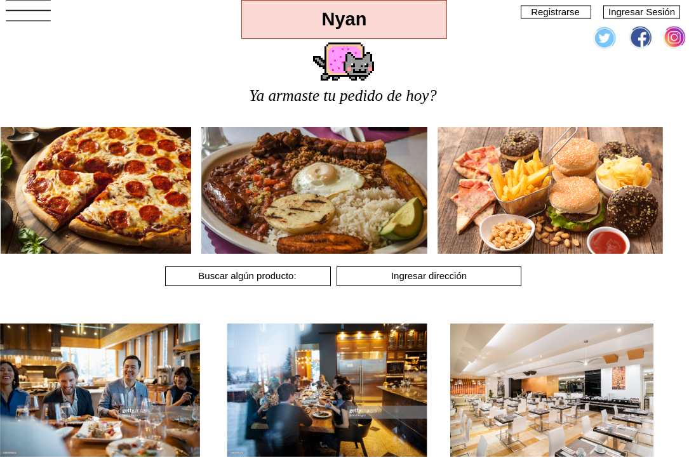

    Cátedra: Programación Orientada a Objetos II 						2019
_ _ _

# Sistema Gestión de Envíos y Pedidos
# Nyan

## Grupo: Click para descargar mas RAM.

1. Gomez Maximiliano David
2. Molina Sebastián
3. Zgarbik Axel Nicolas 

## Visión 

Desarrollaremos una aplicación donde se pueden registrar tanto usuarios, como también empresas proveedoras de productos. Ambos deben poner una dirección donde se buscará los productos (si es una empresa) o donde se enviarán los productos (si es un cliente). La aplicación, a su vez, permite a las empresas mostrar sus catálogos de productos y los clientes pueden elegir y armar su orden.
Ademas de eso proveer al cliente recomendaciones y ofertas correspondientes en su búsqueda, teniendo en cuenta sus elecciones y preferencias.

## Lista de características

1. Logeo con cuentas de google o faceboook.
2. El manejo de comidas a traves de categorias.
3. La posibilidad de que cada cliente arme sus propios productos.
4. El sistema tiene la cualidad de recomendarle comida en base a sus busquedas.
5. En base a la informacion del usuario proveerle descuentos y beneficios.
6. El emitira una notificacion por cada pedido al proveedor de servicio.

## Análisis de Dominio

La aplicacion se desarrollara para plataforma web, la primera version saldra para web, pero teniendo en cuenta el futuro desarrollo de una aplicacion. El uso de la pagina estara destinado para mayores de 16 años (ya que se pueden realizar pagos en ella). El sistema manejara ubicaciones para mostras las posibilidades de servicios de la zona. 

## Bocetos de Interfaz de Usuario

## Casos de Uso

### Actores

1. Comercio: Es el negocio que desea vender sus productos a través de nuestra página.
2. Cliente: Es la persona que desea comprar productos a través de nuesta página.
3. Administrador: Persona encargada de la gestión de la página.

- - - 
- - - 
- - - 

#### Registro de comercio
##### Actores: 
Comercio
##### Objetivo: 
El objetivó de este caso de uso es el registro de un nuevo comercio que proveera un servicio o productos a clientes
##### Flujo Principal:
1. El actor selecciona registrar.
2. El sistema devuelve las opciones de registro.
3. El actor selecciona registrar como comercio.
4. El sistema muestra el formulario para registrar como comercio
5. El actor completa el formulario y acepta
6. El sistema verifica que todos los campos obligatorios esten correctamente cargados.
7. El sistema muestra el mensaje de Registrado con exito.
8. El actor selecciona el ok.
9. Termina el caso de uso.
##### Flujo Alternativo:
6.1 El sistema detecta que falta un campo obligatorio a cargar o mal cargado.

6.2 Muestra un mensaje con el error.

6.3 Vuelve al paso 5 del flujo principal.

- - - 

#### Gestión de Inventario
##### Actor: 
Comercio
##### Objetivo: 
el comercio cargara los productos con el stock de los ingredientes de estos, la cantidad y el valor de cada uno.
##### Flujo Principal:
1. El actor selecciona la pestaña Inventario.
2. El sistema devuelve las opciones de esa pestaña.
3. El actor selecciona nuevo.
4. El sistema devuelve el formulario para los productos y los ingredientes.
5. El actor llena el formulario.
6. El actor presiona el botón aceptar.
7. El sistema registra el nuevo inventario.
8. Termina el caso de uso.
##### Flujo Alternativo:

#Modificación
2.1 El actor selecciona modificar.

2.2 El sistema devuelve los productos e ingredientes.

2.3 El actor cambia lo que necesita.

2.4 El actor presiona el botón aceptar.

2.5 El sistema registra la modificación.

2.6 vuelve al paso 8 del flujo principal.

#Eliminación

2.1 El actor selecciona eliminar.

2.2 El sistema devuelve los productos e ingredientes.

2.3 El actor elimina lo que necesita.

2.4 El actor presiona el botón aceptar.

2.5 El sistema registra la modificación.

2.6 vuelve al paso 8 del flujo principal.

- - -

#### Generar Estadísticas
##### Actor: 
Comercio
##### Objetivo: 
A través del sistema proveer de estadísticas al comercio (producto más vendido, ingrediente más pedido, etc.).
##### Flujo Principal:
1. El actor pulsa la pestaña estadísticas.
2. El sistema solicita un margen de tiempo.
3. El actor ingresa el margen.
4. El sistema devuelve las estadísticas de ese margen de tiempo. 
##### Flujo Alternativa:

2.1 El sistema no encuentra estadísticas en ese margen de tiempo.

2.2 El sistema emite un mensaje con el error.

2.3 Vuelve al paso 2 del flujo principal.

- - -

#### Iniciar Sesión
##### Actor: 
Comercio
##### Objetivo: 
El comercio ya registrado accede a la pagina web.
##### Flujo Principal:
1. El actor selecciona Ingresar.
2. El sistema pide Usuario y contraseña.
3. El sistema verifica la existencia del Usuario.
4. El sistema verifica que el usuario tenga esa contraseña.
5. El actor ingresa a la página web.
6. Termina el caso de uso.
##### Flujo Alternativo:

#Usuario Inválido

3.1 El sistema no encuentra el usuario.

3.2 Emite un mensaje de error.

3.3 Vuelve al paso 2 del flujo principal.

#Contraseña Inválida

4.1 El sistema verifica que el usuario ingresado no tiene esa contraseña.

4.2 El sistema emite un mensaje de error.

4.3 Vuelve al paso 2 del flujo principal.

- - -

__Registrarse__

__Actores__: Clientes.

__Objetivo__: Registrarse a la aplicación para poder utilizarla.

__Flujo Principal__:

1. Este caso de uso comienza cuando el Cliente ingresa a la opción registrarse.
2. El Sistema muestra el formulario de registro.
3. El Cliente ingresa nombre, apellido, mail y contraseña y presiona registrarse.
4. El Sistema valida los campos del formulario para saber si están en bien escritos.
5. El Sistema genera un nuevo cliente con los datos previstos por el Cliente.
6. El Sistema informa que se ha registrado en forma exitosa.

_Curso alternativo_

- 4.1 En el caso de que el mail ya se encuentre registrado, se informa y termina el caso de uso.
- 5.1 En el caso de que el mail y/o contraseña se encuentre escrito de forma incorrecta, se informa y se pasa a el paso 4.

- - - 

__Iniciar Sesión__

__Actores__: Clientes

__Objetivo__: Controla el acceso a la aplicación para los usuarios, y dependiendo del tipo de usuario se habilitarán algunas opciones o se bloquearan otras.

__Flujo Principal__:

1. Este caso de uso comienza cuando el Cliente ingresa a la opción Ingresar/Login.
2. El Sistema muestra el formulario de ingreso.
3. El Cliente ingresa las credenciales y presiona Ingresar.
4. El Sistema verifica si está registrado.
5. El Sistema redirecciona a la página de inicio con el usuario ya logueado.

_Curso alternativo_

- 4.1 En el caso de que no esté registrado, se informa y termina el caso de uso.

- - - 

__Explorar__

__Actores__: Clientes

__Objetivo__: Muestra todos los productos existentes en el catálogo.

__Flujo Principal__:

1. Este caso de uso comienza cuando el Cliente presiona Explorar.
2. El Sistema muestra el catálogo completo.

- - - 

__Seleccionar menú__

__Actores__: Clientes

__Objetivo__: Selecciona los menúes que se agregarán o no al pedido.

__Flujo Principal__:

1. Este caso de uso comienza cuando el Cliente presiona seleccionar en algun menú.
2. El Sistema muestra el menú seleccionado.
3. El Sistema registra que se seleccionó dicho menú.
4. El sistema informa que se seleccionó de forma exitosa.

- - -

__Seleccionar Comercio__

__Actores__: Clientes

__Objetivo__: Selecciona el comercio para ver los menúes que ofrecen.

__Flujo Principal__:

1. Este caso de uso comienza cuando el Cliente presiona seleccionar comercio
2. El Sistema muestra el comercio seleccionado.
3. El Sistema muestra los menúes que ofrece el comercio.
4. El Sistema registra que se seleccionó dicho comercio.
5. El sistema informa que se seleccionó de forma exitosa.

_Curso alternativo_

- 3.1 En el caso de que el comercio no tenga menúes, se informa un error y termina el caso de uso.

- - -
__Hacer un pedido__

__Actores__: Clientes

__Objetivo__: Funcionalidad ofrecida para realizar un pedido.

__Flujo Principal__:

1. Este caso de uso comienza cuando el Cliente 
presiona realizar pedido.
2. El sistema verifica que el Cliente esta logueado.
3. El sistema verifica los comercios seleccionados.
4. El sistema verifica los menúes seleccionados.
5. El sistema registra el pedido que realiza el cliente logueado.
6. El sistema informa que se realizo el pedido de forma exitosa. 

_Curso alternativo_

- 2.1 El cliente no está logueado, ir a caso de uso iniciar sesion.
- 3.1 El cliente no selecciono ningún comercio, ir a caso de uso seleccionar comercio.
- 4.1 El cliente no selecciono ningún menú, ir a caso de uso seleccionar menú. 

- - -

__Seleccionar método de pago__

__Actores__: Clientes

__Objetivo__: Selecciona los metodos de pago para paga el pedido que se está realizando.

__Flujo Principal__:

1. Este caso de uso comienza cuando el Cliente presiona seleccionar método de pago.
2. El Sistema muestra el formulario con las formas de pago.
3. El Cliente selecciona una forma de pago.
4. El sistema verifica que forma de pago seleccionó el cliente.
5. El sistema registra la forma de pago seleccionada.
6. El sistema informa que forma de pago seleccionó.

_Curso alternativo_

- 3.1 

- - -

__Suministrar dirección__

__Actores__: Clientes

__Objetivo__: Funcionalidad para establecer la dirección del cliente.

__Flujo Principal__:

1. Este caso de uso comienza cuando el Cliente presiona agregar dirección.
2. El Sistema verifica que el cliente esté logueado.
3. El sistema muestra el formulario para completar.
4. El cliente ingresa la calle, número, piso, departamento, codigo postal.
5. El sistema guarda y enlaza los datos con el cliente logueado.
6. El sistema informa que se enlazó los datos de forma exitosa.

_Curso alternativo_
- 2.1 En caso de que el cliente no esté logueado, ir a caso de uso iniciar sesión.
- 5.1 En caso de que los datos esten vacios, informar error y volver al paso 4.

- - -

__Enviar Pedido__

__Actores__: Clientes

__Objetivo__: Funcionalidad para enviar el pedido para que el comercio lo haga.

__Flujo Principal__:

1. Este caso de uso comienza cuando el Cliente presiona enviar pedido.
2. El Sistema verifica la direccion del cliente.
3. El Sistema verifica que se realizó el pedido.
4. El Sistema verifica el método de pago.
5. El Sistema registra el envío del pedido al comercio.
6. El Sistema informa que se envió el pedido para que se haga de forma exitosa.

_Curso alternativo_

- 2.1 En caso de que el cliente no tenga direccion, ir a caso de uso suministrar direccion.
- 3.1 En caso de que el cliente no haya realizado el pedido, ir a caso de uso hacer un pedido.
- 4.1 En caso de que no se seleccionó un método de pago, ir a caso de uso seleccionar método de pago.

- - -
- - - 
- - - 

## Arquitectura

Para desarrollar nuestro proyecto usaremos los siguientes programas y herramientas:
- Visual Studio Code
- GitHub
- Insomnia
- Apache NetBeans 11
- Javalin
- Junit
- Maven

## Variante de aplicacion
La aplicacion existente en la cual nos basamos es en pedidosya, globo, rappi. Nuestro sistema difiere de sus mecanicas con la cualidad de poder seleccionar los ingredientes de nuestro pedido, haciendo que nuestros clientes tengan la posibilidad de hacer pedidos personalizados.
Otra variante con este sistema es en el cual las empresas tendran nuevas ideas para cambiar sus menus e incorporar distintos tipos nuevos de comida. 

