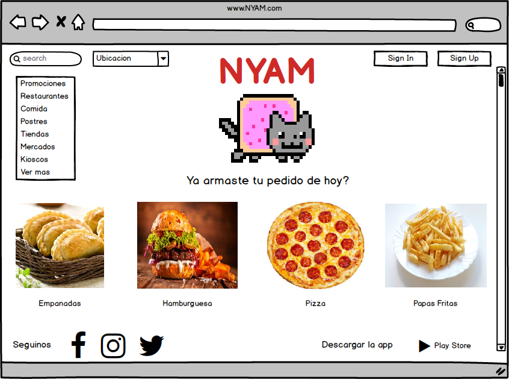
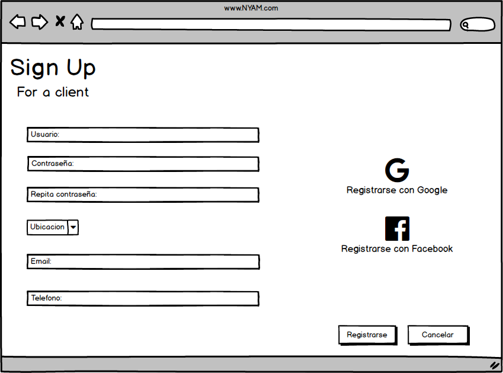
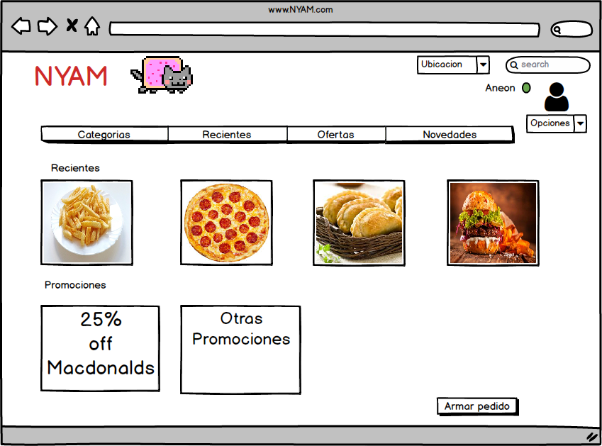
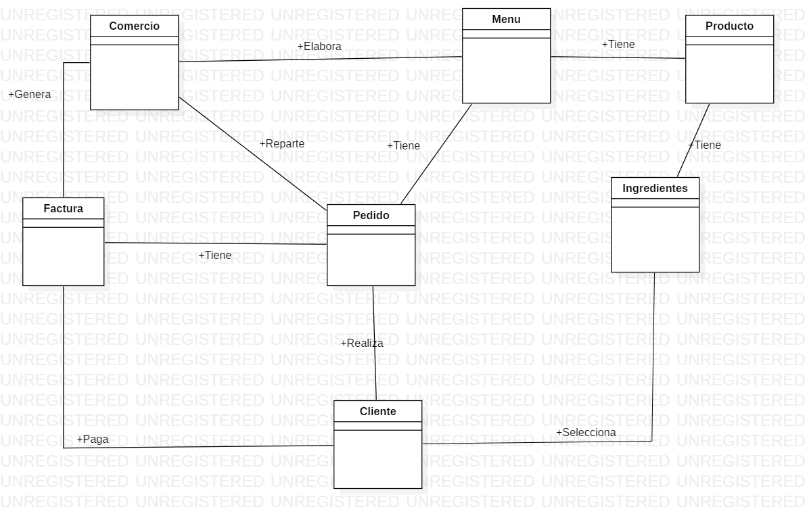

# Sistema Gestión de Envíos y Pedidos
# Nyan

## Grupo: Click para descargar mas RAM.

1. Gomez Maximiliano David
2. Molina Sebastián
3. Zgarbik Axel Nicolas 

## Visión 

Desarrollaremos una aplicación donde se pueden registrar tanto usuarios, como también comercios proveedores de productos. Ambos deben poner una dirección donde se buscará los productos (si es una empresa) o donde se enviarán los productos (si es un cliente). La aplicación, a su vez, permite a las empresas mostrar sus catálogos de productos y los clientes pueden elegir y armar su orden.
Ademas de eso proveer al cliente recomendaciones y ofertas correspondientes a su búsqueda, teniendo en cuenta sus elecciones y preferencias y al comercio, le generara estadisticas sobre los productos mas vendidos.

## Lista de características

### Caracteristicas clave
1. El manejo de comidas a traves de categorias.
2. La posibilidad de que cada cliente arme sus propios productos.
3. El sistema tiene la cualidad de recomendarle comida en base a sus busquedas.
4. En base a la informacion del usuario proveerle descuentos y beneficios.
5. Generar estadisticas al comercio.

### Caracteristicas extendidas
1. El emitira una notificacion por cada pedido al proveedor de servicio.
2. Logearse atravez de facebook o google.
3. Posibilitar diferentes metodos de pagos.

## Bocetos de Interfaz de Usuario
### Pantalla Principal

### Pantalla de registro de usuario

### Pantalla de registro de comercio

### Pantalla de Inisio de Sesion

### Pantalla Principal del Cliente

## Diagrama de clases (No definitivo)
