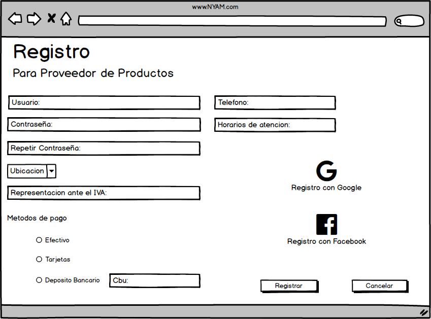

# Sistema Gestión de Envíos y Pedidos
# Nyan

## Grupo: Click para descargar mas RAM.

1. Gomez Maximiliano David
2. Molina Sebastián
3. Zgarbik Axel Nicolas 

## Visión 

Desarrollaremos una aplicación donde se pueden registrar tanto usuarios, como también proveedores de productos. Ambos deben poner una dirección donde se buscará los productos (si es una empresa) o donde se enviarán los productos (si es un usuario). La aplicación, a su vez, permite a las empresas mostrar sus catálogos de productos y los usuarios pueden elegir y armar su orden.
Ademas de eso proveer al usuario recomendaciones y ofertas basadas en sus compras anteriores, teniendo en cuenta sus elecciones y preferencias y al proveedor de producto, le generara estadisticas sobre los productos mas vendidos.

## Lista de características

### Caracteristicas clave
1. Habilidad de buscar a traves de categorias.
2. Posibilidad de que cada usuario arme sus propios productos.
3. El sistema tiene la capacidad de recomendar busquedas al cliente.
4. En base a la informacion del usuario o a dias festivos los proveedores de productos podran realizar descuentos y beneficios a sus usuarios.
5. Generar estadisticas al proveedor de producto.

### Caracteristicas extendidas
1. Habilidad de realizar notificaciones a los proveedores de productos.
2. Posibilidad de ingresar a traves de facebook o google.
3. Posibilitad de usar diferentes metodos de pagos.
4. Posibilidad de calificar a los proveedores de productos.

## Análisis de Dominio

Nuestro sistema comprende a dos usuarios. El usuario que utiliza la aplicación para realizar pedidos o consultar precios, por otro lado, tenemos a los usuarios que se registran como proveedores de productos. Éstos se encargan de publicar menúes, los cuales se muestran en la pantalla principal de navegación de la aplicación. Éstos menúes tienen la caracteristica de que los usuarios pueden personalizar los ingredientes que lo componen. Al realizarse el pedido, el proveedor de productos, deberá realizar el servicio de delivery, si así lo especificó el usuario que solicito el pedido. Además la aplicación permitirá valorar a los proveedores de productos y generar estadísticas de datos específicos en un rango de tiempo.

## Casos de Uso

### Actores

1. __Proveedor productos__: Es el negocio que desea comercializar sus productos a través de la app.
2. __Usuario__: Es la persona que desea comprar productos a través de nuesta página.
3. __Administrador__: Persona encargada de la gestión de la página.
4. __Tiempo__: Efecto externo para el control del sistema.

## __Registrar proveedor de producto__

__Actores__: Proveedor de productos.

__Objetivo__: Registro de un nuevo proveedor de productos.

__Flujo Principal__:

1. Este caso de uso comienza cuando el proveedor de productos ingresa a la opción registrarse.
2. El sistema devuelve las opciones de registro.
3. El actor selecciona registrar como proveedor de productos.
4. El sistema muestra el formulario de registro.
5. El actor completa el formulario y presiona registrarse.
6. El sistema verifica que todos los campos obligatorios esten correctamente cargados.
7. El Sistema informa que se ha registrado en forma exitosa.
8. El Sistema genera un nuevo proveedor de productos con los datos provistos.

_Curso alternativo_

6.1 El sistema detecta que falta un campo obligatorio a cargar o mal cargado.

6.2 Muestra un mensaje con el error.

6.3 Vuelve al paso 5 del flujo principal.

- - - 
falta pantalla donde selecciona "el registro"
### Pantalla de registro de proveedor de producto

- - -

## __Registrar Usuario__

__Actores__: Usuario.

__Objetivo__: Registro de un nuevo usuario a la aplicación.

__Flujo Principal__:

1. Este caso de uso comienza cuando el Cliente ingresa a la opción registrarse.
2. El sistema devuelve las opciones de registro.
3. El actor selecciona registrar como usuario.
4. El Sistema muestra el formulario de registro.
5. El Cliente completa el formulario con nombre, apellido, mail, telefono, contraseña y presiona registrarse.
6. El sistema verifica que todos los campos obligatorios esten correctamente cargados.
7. El Sistema genera un nuevo cliente con los datos previstos.
8. El Sistema informa que se ha registrado en forma exitosa.

_Curso alternativo_

#Campos faltantes

6.1 El sistema detecta que falta un campo obligatorio a cargar o mal cargado.

6.2 Muestra un mensaje con el error.

6.3 Vuelve al paso 3 del flujo principal.

#Usuario ya registrado

6.1 El sistema detecta que el mail ya se encuentre registrado

6.2 Muestra un mensaje con el error.

6.3 Vuelve al paso 3 del flujo principal.

- - -
falta pantalla donde selecciona "el registro"
### Pantalla de registro de usuario

# modificar pantalla para que diga "usuario"
- - -

## __Gestionar Inventario__

__Actores__: Proveedor de productos.

__Objetivo__: Cargar los productos, indicando stock, ingredientes, la cantidad y valor de cada uno.

__Flujo Principal__:

1. Este caso de uso comienza cuando el proveedor de productos selecciona la pestaña Inventario.
2. El sistema devuelve las opciones de esa pestaña.
3. El actor selecciona nuevo.
4. El sistema devuelve el formulario para los productos y los ingredientes.
5. El actor completa el formulario y presiona aceptar.
6. El sistema registra el nuevo inventario.
   
_Curso alternativo_

#Modificación

3.1 El actor selecciona modificar.

3.2 El sistema devuelve los productos e ingredientes.

3.3 El actor cambia lo que necesita y presiona aceptar.

3.4 El sistema registra la modificación.

#Eliminación

3.1 El actor selecciona eliminar.

3.2 El sistema devuelve los productos e ingredientes.

3.3 El actor elimina lo que necesita y presiona aceptar.

3.4 El sistema registra la modificación.

- - - 
# HACER BOCETO DE COMO SERIA ESTOOOOOOOOOO

- - -

## __Proveer estadisticas al proveedor de productos__

__Actores__: Proveedor de productos.

__Objetivo__: A través del sistema proveer de estadísticas al proveedor de productos (producto más vendido, ingrediente más pedido, etc.).

_Curso alternativo_

1. Este caso de uso comienza cuando el proveedor de productos selecciona la pestaña Estadisticas.
2. El sistema solicita un margen de tiempo.
3. El actor lo ingresa y presiona aceptar.
4. El sistema muestra los resultados de ese margen de tiempo. 

_Curso alternativo_

2.1 El sistema no encuentra estadísticas en ese margen de tiempo.

2.2 El sistema emite un mensaje con el error.

2.3 Vuelve al paso 2 del flujo principal.

- - -

### Pantalla de Estadisticas

- - -

## __Iniciar Sesión__

__Actores__: Proveedor de productos, Usuario.

__Objetivo__: Un actor ya registrado quiere acceder a la pagina web.

__Flujo Principal__:

1. Este caso de uso comienza cuando el proveedor de productos selecciona Iniciar Sesión.
2. El sistema muestra el formulario de ingreso.
3. El actor ingresa las credenciales.
4. El sistema verifica las credenciales.
5. El Sistema redirecciona a la página de inicio, mostrando los productos más elegidos por los clientes separado por categorias.

_Curso alternativo_

#Usuario Inválido

4.1 El sistema no encuentra el usuario.

4.2 Muestra un mensaje de error.

#Contraseña Inválida

4.1 El sistema verifica que el usuario ingresado no tiene esa contraseña.

4.2 Muestra un mensaje de error.

- - -
### Pantalla de Inicio de Sesion

- - - 

## __Buscar__

__Actores__: Usuario.

__Objetivo__: El usuario busca los productos o menúes que quiere.

__Flujo Principal__:

1. Este caso de uso comienza cuandpresiona realizar pedido.o el usuario se posiciona en la barra de busqueda.
2. El usuario ingresa lo que desea buscar y presiona buscar.
3. El sistema devuelve productos relacionados con la busqueda.

_Curso alternativo_

#Busqueda no encontrada

3.1 En el caso de que el sistema no encuentre productos relacionados.

3.2 Muestra un mensaje de error.

- - - 
## agregar boceto de pantalla "busqueda"
- - -

## __Seleccionar menú__

__Actores__: Usuario.

__Objetivo__: Seleccionar menúes que se agregarán al pedido.

__Flujo Principal__:

1. Este caso de uso comienza cuando el Usuario selecciona un menú.
2. El Sistema registra que se seleccionó dicho menú.
3. El Sistema muestra la información del menú seleccionado.

- - -
## agregar boceto de pantalla
- - -

__Seleccionar proveedor de producto__

__Actores__: Usuario

__Objetivo__: Selecciona un proveedor de productos para ver los menúes que ofrecen.

__Flujo Principal__:

1. Este caso de uso comienza cuando el usuario selecciona un proveedor de productos de la lista.
2. El Sistema registra que se seleccionó dicho proveedor de productos.
3. El Sistema muestra los menúes que ofrece el proveedor de productos.

- - -
## agregar boceto de pantalla
- - -

## __Agregar menú a un pedido__

__Actores__: Usuario

__Objetivo__: Funcionalidad ofrecida para agregar menúes a un pedido.

__Flujo Principal__:

1. Este caso de uso comienza cuando el usuario selecciona un menú y presiona agregar al pedido.
2. El sistema verifica que el Cliente esta logueado.
3. El sistema verifica el proveedor de productos seleccionados.
4. El sistema verifica el menú seleccionado.
5. El sistema registra el pedido que realiza el cliente logueado.
6. El sistema informa que se realizo el pedido de forma exitosa. 

_Curso alternativo_

- 2.1 El cliente no está logueado, ir a caso de uso iniciar sesion.
- 3.1 El cliente no selecciono ningún comercio, ir a caso de uso seleccionar comercio.
- 4.1 El cliente no selecciono ningún menú, ir a caso de uso seleccionar menú. 

- - -
## agregar boceto de pantalla
- - - 

## __Cancelar Pedido__

__Actores__: Usuario

__Objetivo__: Funcionalidad ofrecida para descartar un pedido.

__Flujo Principal__:

1. Este caso de uso comienza cuando el usuario selecciona cancelar pedido.
2. El sistema muestra un pop-up de confirmacion que pregunta ¿desea cancelar el pedido?
3. El usuario presiona en el boton si.
4. El sistema registra la opcion marcada del usuario y quita los menues del pedido.
5. El sistema informa que se cancelo pedido de forma exitosa. 

_Curso alternativo_

#No cancela el pedido
3.1 En caso de que el usuario presiona en el boton de no.
3.2 El sistema registra la opcion marcada.
3.3 Vuelve a la pantalla anterior.

- - -
## agregar boceto de pantalla
- - -

## __Moderar la aplicación Web__

__Actores__: Administrador

__Objetivos__: el objetivo de este caso de uso es que el administrador realice un control sobre los usuarios que no han cumplido con las normas y políticas de la aplicación.

__Flujo principal__:
1. El actor solicita registro de usuarios que han solicitado y cancelado productos.
2. El sistema devuelve la lista de usuarios solicitada.
3. El actor le informa a través de un mail la penalización.
4. El sistema muestra mensaje de confirmación.
5. Termina el caso de uso.

_Flujo Alternativo_: 

1.1 No hay usuarios que hayan cancelado productos.

1.2 El sistema devuelve mensaje de error.

1.3 Vuelve al paso 1.

- - -
## agregar boceto de pantalla
- - -

