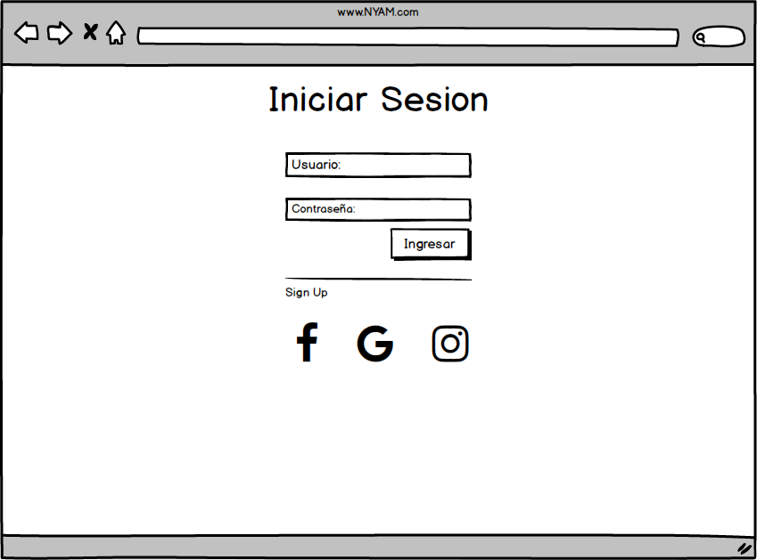
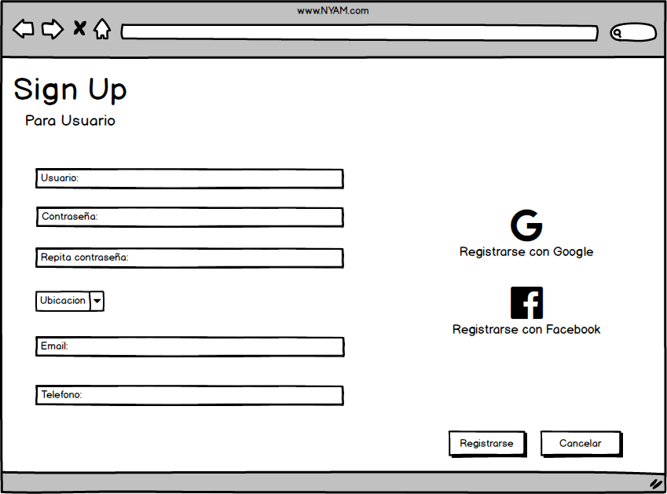

# Sistema Gestión de Envíos y Pedidos
# Nyan

## Grupo: Click para descargar mas RAM.

1. Gomez Maximiliano David
2. Molina Sebastián
3. Zgarbik Axel Nicolas 

## Visión 

Desarrollaremos una aplicación donde se pueden registrar tanto usuarios, como también proveedores de productos. Ambos deben poner una dirección donde se buscará los productos (si es una empresa) o donde se enviarán los productos (si es un usuario). La aplicación, a su vez, permite a las empresas mostrar sus catálogos de productos y los usuarios pueden elegir y armar su orden.
Ademas de eso proveer al usuario recomendaciones y ofertas basadas en sus compras anteriores, teniendo en cuenta sus elecciones y preferencias y al proveedor de producto, le generara estadisticas sobre los productos mas vendidos.

## Lista de características

### Caracteristicas clave
1. Habilidad de buscar a traves de categorias.
2. Posibilidad de que cada usuario arme sus propios productos.
3. El sistema tiene la capacidad de recomendar busquedas al cliente.
4. En base a la informacion del usuario o a dias festivos los proveedores de productos podran realizar descuentos y beneficios a sus usuarios.
5. Generar estadisticas al proveedor de producto.

### Caracteristicas extendidas
1. Habilidad de realizar notificaciones a los proveedores de productos.
2. Posibilidad de ingresar a traves de facebook o google.
3. Posibilitad de usar diferentes metodos de pagos.
4. Posibilidad de calificar a los proveedores de productos.

## Análisis de Dominio

Nuestro sistema comprende a dos usuarios. El usuario que utiliza la aplicación para realizar pedidos o consultar precios, por otro lado, tenemos a los usuarios que se registran como proveedores de productos. Éstos se encargan de publicar menúes, los cuales se muestran en la pantalla principal de navegación de la aplicación. Éstos menúes tienen la caracteristica de que los usuarios pueden personalizar los ingredientes que lo componen. Al realizarse el pedido, el proveedor de productos, deberá realizar el servicio de delivery, si así lo especificó el usuario que solicito el pedido. Además la aplicación permitirá valorar a los proveedores de productos y generar estadísticas de datos específicos en un rango de tiempo.

## Casos de Uso

### Actores

1. __Proveedor productos__: Es el negocio que desea comercializar sus productos a través de la app.
2. __Usuario__: Es la persona que desea comprar productos a través de nuesta página.
3. __Administrador__: Persona encargada de la gestión de la página.
4. __Tiempo__: Efecto externo para el control del sistema.

__Registrar proveedor de producto__

__Actores__: Proveedor de productos

__Objetivo__: Registro de un nuevo proveedor de productos.

__Flujo Principal__:

1. Este caso de uso comienza cuando el proveedor de productos ingresa a la opción registrarse.
2. El sistema devuelve las opciones de registro.
3. El actor selecciona registrar como proveedor de productos.
4. El sistema muestra el formulario de registro.
5. El actor completa el formulario y presiona registrarse.
6. El sistema verifica que todos los campos obligatorios esten correctamente cargados.
7. El Sistema informa que se ha registrado en forma exitosa.
8. El Sistema genera un nuevo proveedor de productos con los datos provistos.

_Curso alternativo_

6.1 El sistema detecta que falta un campo obligatorio a cargar o mal cargado.

6.2 Muestra un mensaje con el error.

6.3 Vuelve al paso 5 del flujo principal.

- - - 
### Pantalla de registro de proveedor de producto

- - -

- - -

__Gestionar Inventario__

__Actores__: Proveedor de productos

__Objetivo__: Cargar los productos, indicando stock, ingredientes, la cantidad y valor de cada uno.

__Flujo Principal__:

1. Este caso de uso comienza cuando el proveedor de productos selecciona la pestaña Inventario.
2. El sistema devuelve las opciones de esa pestaña.
3. El actor selecciona nuevo.
4. El sistema devuelve el formulario para los productos y los ingredientes.
5. El actor completa el formulario y presiona aceptar.
6. El sistema registra el nuevo inventario.
   
_Curso alternativo_

#Modificación
3.1 El actor selecciona modificar.

3.2 El sistema devuelve los productos e ingredientes.

3.3 El actor cambia lo que necesita y presiona aceptar.

3.4 El sistema registra la modificación.

#Eliminación

3.1 El actor selecciona eliminar.

3.2 El sistema devuelve los productos e ingredientes.

3.3 El actor elimina lo que necesita y presiona aceptar.

3.4 El sistema registra la modificación.

- - - 
# HACER BOCETO DE COMO SERIA ESTOOOOOOOOOO

- - -

__Proveer estadisticas al proveedor de productos__

__Actores__: Proveedor de producto

__Objetivo__: A través del sistema proveer de estadísticas al proveedor de productos (producto más vendido, ingrediente más pedido, etc.).

_Curso alternativo_

1. Este caso de uso comienza cuando el proveedor de productos selecciona la pestaña Estadisticas.
2. El sistema solicita un margen de tiempo.
3. El actor lo ingresa y presiona aceptar.
4. El sistema muestra los resultados de ese margen de tiempo. 

_Curso alternativo_

2.1 El sistema no encuentra estadísticas en ese margen de tiempo.

2.2 El sistema emite un mensaje con el error.

2.3 Vuelve al paso 2 del flujo principal.

- - -

### Pantalla de Estadisticas

- - -

__Iniciar Sesión__

__Actores__: Proveedor de productos, Usuario

__Objetivo__: Un actor ya registrado quiere acceder a la pagina web.

__Flujo Principal__:

1. Este caso de uso comienza cuando el proveedor de productos selecciona Iniciar Sesión.
2. El sistema muestra el formulario de ingreso.
3. El actor ingresa las credenciales.
4. El sistema verifica las credenciales.
5. El Sistema redirecciona a la página de inicio, mostrando los productos más elegidos por los clientes separado por categorias.

_Curso alternativo_

#Usuario Inválido

4.1 El sistema no encuentra el usuario.

4.2 muestra un mensaje de error.

#Contraseña Inválida

4.1 El sistema verifica que el usuario ingresado no tiene esa contraseña.

4.2 Muestra un mensaje de error.

- - -
### Pantalla de Inicio de Sesion

- - - 

- - -
- 
## Bocetos de Interfaz de Usuario
### Pantalla Principal

### Pantalla de registro de usuario

### Pantalla de registro de proveedor de producto

## Diagrama de clases (No definitivo)
